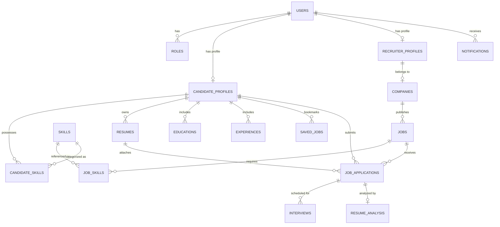

# Database Architecture & Schema — HireHub AI

HireHub AI uses **PostgreSQL 15+** with the **`pgvector`** extension hosted on **Supabase**. All tables inherit audit metadata (`createdAt`, `updatedAt`, `createdBy`, `updatedBy`, `isDeleted`) via JPA mapped superclasses, implementing soft-deletions.

---

## 1. Entity-Relationship Diagram (Mermaid)



---

## 2. Core Tables Schema Summary

| Table | Primary Key | Key Foreign Keys | Purpose |
|---|---|---|---|
| `users` | `id` (UUID) | `role_id` $\rightarrow$ `roles.id` | Authentication identity synced with Supabase Auth |
| `roles` | `id` (UUID) | None | System roles (`ADMIN`, `RECRUITER`, `CANDIDATE`) |
| `candidate_profiles`| `id` (UUID) | `user_id` $\rightarrow$ `users.id` | Candidate bio, headline, experience, embedding |
| `recruiter_profiles`| `id` (UUID) | `user_id`, `company_id` | Recruiter designation and corporate association |
| `companies` | `id` (UUID) | None | Corporate brand, size, logo URL, verified status |
| `jobs` | `id` (UUID) | `company_id`, `recruiter_id` | Job postings, description, salary, status, embedding |
| `skills` | `id` (UUID) | None | Normalized technical and soft skills taxonomy |
| `candidate_skills` | `id` (UUID) | `candidate_id`, `skill_id` | Candidate verified skills with proficiency level |
| `job_skills` | `id` (UUID) | `job_id`, `skill_id` | Required vs preferred job competencies |
| `resumes` | `id` (UUID) | `candidate_id` | Storage URLs, ATS scores, PDF text, embedding |
| `job_applications` | `id` (UUID) | `job_id`, `candidate_id`, `resume_id` | Multi-stage recruitment tracking pipeline |
| `interviews` | `id` (UUID) | `application_id`, `recruiter_id` | Scheduled rounds, meeting URLs, interviewer feedback |
| `notifications` | `id` (UUID) | `user_id` $\rightarrow$ `users.id` | In-app alerts, read status, action deep-links |
| `saved_jobs` | `id` (UUID) | `candidate_id`, `job_id` | Saved bookmarks for candidate review |

---

## 3. Flyway Versioned Migrations

1. **`V1__initial_schema.sql`**: Complete relational schema for users, profiles, jobs, applications, interviews, notifications, and base tables.
2. **`V2__indexes_and_optimizations.sql`**: B-Tree composite indexes for candidate search, recruiter job feeds, and notification queries.
3. **`V3__resume_analysis.sql`**: JSONB schema columns for multi-dimensional ATS category scores and improvement suggestions.
4. **`V4__embeddings.sql`**: Activates PostgreSQL `pgvector` extension; defines 768-dimensional vector columns and fallback JSON embedding caches.
5. **`V5__performance_indexes.sql`**: Soft-delete aware partial indexes (`WHERE is_deleted = false`) targeting high-traffic feeds.

---

## 4. Performance Index Strategy

```sql
-- Fast active job feed query
CREATE INDEX idx_jobs_active_non_deleted 
    ON jobs(status, is_deleted, created_at DESC) 
    WHERE is_deleted = false;

-- Low-latency recruiter application pipeline
CREATE INDEX idx_job_applications_pipeline 
    ON job_applications(job_id, status, is_deleted, created_at DESC) 
    WHERE is_deleted = false;

-- Unread notifications badge lookup
CREATE INDEX idx_notifications_unread_fast 
    ON notifications(user_id, is_read, created_at DESC) 
    WHERE is_deleted = false;
```
